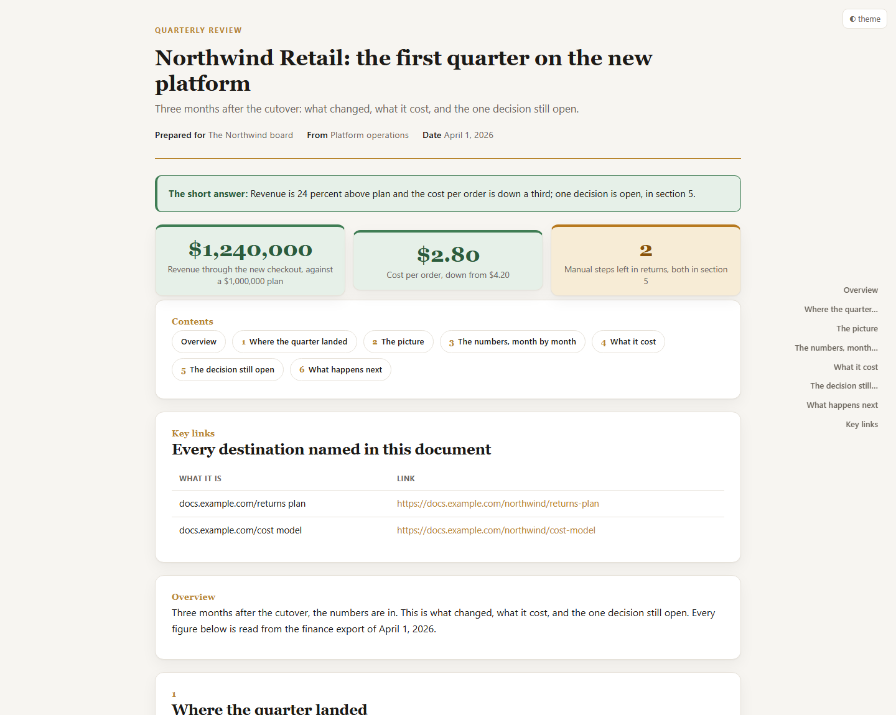
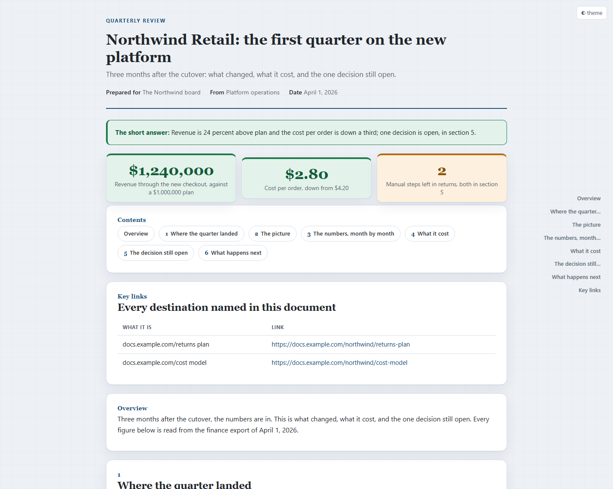
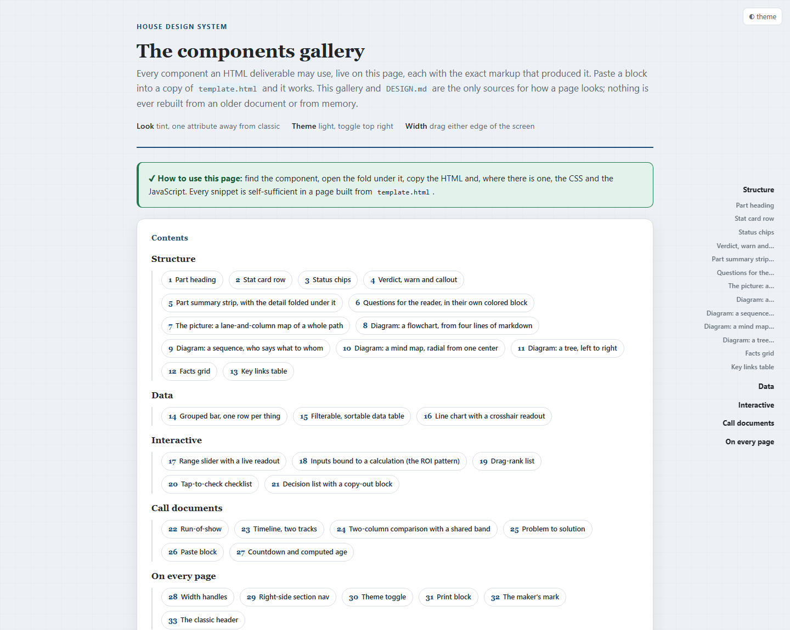

# html-deliverable

**Build polished, standalone HTML documents from markdown, CSV or JSON.** One command to build,
one command to check, and a mandatory lint that refuses the twenty-odd ways a generated document
usually embarrasses you. A Claude Code skill, and a plain Python toolchain underneath it.

<p align="center">
  
</p>

Markdown is good for the writer. HTML is good for the reader: it keeps the layout, the filters,
the sliders and the theme toggle, it opens anywhere with no app, and it still works when somebody
drags it into a chat message on a plane. This is the toolchain that turns the first into the
second without a design decision per document.

---

## Install (the 30-second version)

```bash
git clone https://github.com/RobBrautigam/html-deliverable.git
cd html-deliverable

# Claude Code, globally
cp -R skills/html-deliverable ~/.claude/skills/

# the only dependency, and only for markdown input
pip install markdown
```

Then ask any Claude Code session for an HTML report, a one-pager or a formatted document, and the
skill fires on its own description. Or use the toolchain directly, with no agent involved:

```bash
python skills/html-deliverable/build.py notes.md out.html --surface report \
  --title "The first quarter" --verdict "Revenue is above plan; one decision is open."
python skills/html-deliverable/lint.py out.html --playwright --money
```

The example above is in this repository: [`examples/sample-report.md`](examples/sample-report.md)
is the source, [`examples/sample-report.html`](examples/sample-report.html) is what the build
produced, and it passes the lint at 1440 and 390 in both themes.

**Requirements:** Python 3.12 or newer, the `markdown` package for markdown input (CSV and JSON
need nothing), and, for the render check, Playwright (`pip install playwright && playwright
install chromium`, or a Node `playwright` the lint can find). Two optional diagram engines, d2 and
Graphviz, are only needed if a document uses `[diagram:]` blocks; the builder names the install
command when one is missing.

---

## Why it exists

Generated HTML documents rot in a specific way. Each new one is built from a copy of the last one
rather than from a design system, so the look drifts backwards, and the checks nobody remembers to
run are the ones that catch the embarrassing defects.

A measured inventory of 186 documents built over two months, all by the same automation, found:

| Fact | Measurement |
|---|---|
| Reading width | **26 distinct values**, from 660px to 1500px |
| Section nav | **68 files had none**; 42 used a smooth scroll that silently jumps under reduced motion |
| Interactivity | **150 of 186 carried none at all**, including pages whose content is a table a reader would want to sort |
| Theme | 54 had no toggle; 30 switched to dark on the reader's OS setting, unasked |
| Print block | 44 had none, on documents that get printed |
| Punctuation | 43 carried a mid dot, one of them 103 times in entity form |

Every one of those is now either impossible (the builder does it) or refused (the lint fails the
file). That is the whole idea: **a page that has not been linted has not been checked.**

---

## What you get

### Four surfaces, one house style

Pick one before writing a line. The palette, the type, the theme toggle, the right-side nav and
the print block are identical across all four: only the structure changes.

| Surface | Use it for |
|---|---|
| **report** (the default) | anything somebody reads: a status report, an audit, a research brief, a decision pack |
| **deck** | a call document: an agenda you screen-share that keeps working after the call |
| **poster** | a client one-pager: hero, three numbers, problem to solution, one call to action |
| **data-report** | a numbers page from a CSV or a JSON export: KPI cards, charts, the table, the method |

### Two looks, one attribute

<p align="center">
  
</p>

The same document above, in the tint look. The look is one attribute on `<html>`; nothing else
changes between them. Classic is a warm, formal report; tint is a cooler reading surface on 28px
graph paper. Both ship light by default with a dark toggle, and both read the same design tokens,
so a look change is one attribute rather than a rewrite.

### A gallery that is the source, not a picture of it

<p align="center">
  
</p>

`components.html` is generated from the same catalogue the builder imports, so a component's demo
and its copy-paste snippet are the same text by construction. Thirty-three components: stat rows,
status chips, verdict and warn boxes, part summary strips with fold-outs, a questions block, a
lane-and-column workflow map, four diagram kinds, facts grids, key-link tables, a grouped bar, a
filterable sortable table, a line chart with a crosshair readout, sliders, an ROI calculator, a
drag-rank list, a checklist, a decision list with a copy-out block, a run-of-show, a timeline, a
comparison, a problem-to-solution block, a countdown, and the four every page carries.

Open it in a browser before building anything non-trivial.

### A lint that refuses, rather than a style guide nobody reads

```bash
python lint.py out.html --playwright --money --widths 1440,1920,390
python lint.py out.html --audience external --allow "Acme"
```

- **The wall list.** No company or client name the page was not given, read over the WHOLE file:
  the visible words, the attributes, the comments and the stylesheet. On an external page it is a
  refusal. This exists because a one-pager built from a house template once carried another
  client's short name in a CSS selector and a third company's name in a comment, invisible on the
  page and one find-in-page away from the reader.
- **No value may leave its box.** A `white-space: nowrap` value too long for its card spills
  INSIDE a page that does not overflow at all, so the page-level check passes and the reader still
  sees a number running out of its box. The render measures every element a value can sit in, at
  every width and in both themes. Proved by inversion on a pair of fixtures that differ in exactly
  one CSS declaration.
- **Figures are measured, not looked at.** Seven refusals, each proved by a fixture that breaks
  exactly that rule: text outside the box it belongs to, a label painted under a shape that covers
  it, a connector routed through a node, two boxes on top of each other, a tag over somebody
  else's box, a figure that drew nothing, and a figure wider than its column.
- **Every dollar amount carries a dollar sign**, in prose, in tables, in cards and inside a
  figure's JSON block. Three ways an amount loses its sign, three arms, three fixtures.
- **The flat page.** Over about 3,000 prose words, every long section must open with a summary
  block and the page must use color to mark meaning. Missing either half is the hit.
- Plus: em dashes and mid dots (raw and entity), terminal commands in reader-facing prose, a
  missing Key links table, an external link that does not open in a new tab, a missing section nav
  or width handles, a dark default, an external script or font, a leftover `REPLACE`, a `<ul>`
  inside a `<p>`, a nav taller than the viewport, a stranded heading, and a tab title that
  disagrees with the page's own `<h1>`.

### Tested, including in a real browser

```bash
python -m pytest skills/html-deliverable
```

**348 tests.** They cover the builder, the lint, the design system, the diagram engines, the
figure gates, the large-document rules and the page contract. Forty-one of them drive a headless
browser: they click every filter, sort every table, drag the width handles, hover the chart
crosshair, flip the theme, drive a page inside a frame, and measure the rendered geometry. Without
Playwright those forty-one SKIP with a named reason rather than passing quietly, and the other 307
still run.

---

## What is in the box

```
html-deliverable/
├── README.md                    ← you are here
├── LICENSE                      ← MIT
├── .claude-plugin/plugin.json   ← the Claude Code plugin manifest
├── examples/
│   ├── sample-report.md         ← the source
│   ├── sample-report.html       ← what the build produced, lint-clean
│   └── *.png                    ← the screenshots above
└── skills/html-deliverable/
    ├── SKILL.md                 ← when to build one, and what goes in it
    ├── DESIGN.md                ← the authority on how a page LOOKS
    ├── components.html          ← the live gallery, generated
    ├── template.html            ← the house base: tokens, nav, handles, print, frame contract
    ├── templates/               ← the four surface modules
    ├── build.py                 ← markdown, CSV or JSON in, one HTML file out
    ├── lint.py                  ← the pre-delivery gate
    ├── build_gallery.py         ← the component catalogue, and the gallery it generates
    ├── serve.py                 ← local HTTP so the page live-reloads while you edit it
    ├── interactions.js          ← drives every interactive piece in a real browser
    ├── chartcheck.js            ← drives the line chart and reports what was drawn
    ├── domcheck.js              ← duplicate ids and leaked source, from the parsed DOM
    ├── wall-list.txt            ← the names a delivered page may never carry
    ├── fixtures/                ← the inversion proofs: one file per rule, each breaking it
    └── test_*.py                ← 348 tests
```

---

## Making it yours

Three files carry everything you would want to change:

1. **`wall-list.txt`** ships two fictional names. Replace them with your own companies, products
   and clients, one per line. That is the whole configuration of the leak check.
2. **`template.html`** carries the palette as CSS custom properties at the top of its `<style>`
   block, in five theme blocks. Change the accent pair and every component follows, because no
   component carries a raw hex value and a test enforces that.
3. **`DESIGN.md`** is prose you own. When somebody corrects a document you produced, fold the
   correction into that file in the same session, add the component to `build_gallery.py`, rebuild
   the gallery, and write the test. That loop is why the toolchain has 348 tests and not twelve.

A client build wears the client's own colors, which is one line overriding `--acc` on the page,
never a change to the design system.

---

## Credits

The surface idea (choose the shape of the document before writing a line, and let the surface lock
the structure so the model cannot freestyle the layout) was taken from
[nexu-io/html-anything](https://github.com/nexu-io/html-anything), along with one hard-won
technical lesson: a responsive chart whose parent has no explicit height enters a ResizeObserver
feedback loop and grows until the tab hangs. None of its look ships here, and the surfaces are
deliberately different: this repository's deck is a call document rather than a swipe deck, and
its poster is a one-pager somebody reads on a laptop and prints rather than a social image.

The diagram engines are [d2](https://github.com/d2lang/d2) (MPL-2.0) and
[Graphviz](https://graphviz.org/) (EPL-2.0), both run locally at build time. `DESIGN.md`
section 3a carries the comparison that chose them over Mermaid, Excalidraw, Kroki and Penrose,
with the constraint each was measured against.

---

## License

MIT. Use it, fork it, change anything. See [LICENSE](LICENSE).
